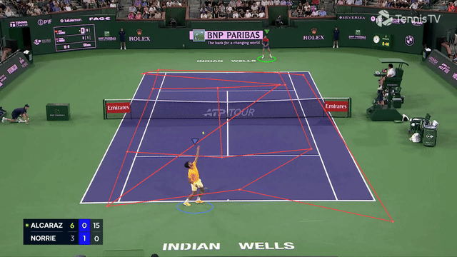

# Tennis Analysis



Tennis ball tracking, player detection, and court keypoint detection using deep learning.

- **Ball Tracking**: TrackNet (2D U-Net) for heatmap prediction + InpaintNet (1D U-Net) for trajectory gap filling
- **Player Detection**: RF-DETR (Detection Transformer) for real-time player bounding boxes
- **Court Detection**: YOLO-Pose for 14-keypoint court geometry estimation

## Project Structure

This project follows the [Cookiecutter Data Science](https://cookiecutter-data-science.drivendata.org/) (CCDS v2) convention.

```
Tennis_Analysis/
├── Makefile                  # Convenience commands (make train, make test, etc.)
├── README.md                 # This file
├── pyproject.toml            # Package metadata and dependencies
├── requirements.txt          # Flat dependency list
│
├── configs/                  # Experiment configs and label corrections
│   ├── drop_frame.json
│   ├── court_keypoint.yaml   # YOLO dataset config for court keypoints
│   └── corrected_test_label/
│
├── data/                     # Dataset storage — NOT committed to git
│   ├── raw/                  # Original immutable datasets and test videos
│   ├── interim/              # Intermediate transformed data
│   ├── processed/            # Final canonical data for modeling
│   └── external/             # Third-party data sources
│
├── docs/                     # Project documentation
├── references/               # Data dictionaries, manuals, explanatory materials
├── reports/                  # Generated analysis outputs
│   └── figures/              # Generated graphics and annotated frames
│
├── models/                   # Trained model checkpoints (not committed)
│   ├── player_detection/     # RF-DETR checkpoints from SageMaker
│   └── court_keypoint/       # YOLO-Pose weights from SageMaker
│
├── notebooks/                # Jupyter notebooks for exploration
│                             # Naming: <number>-<initials>-<description>.ipynb
│
├── experiments/              # Experiment outputs, TensorBoard logs, results
│
├── src/                      # Main Python package (installable via pip install -e .)
│   ├── datasets/             # Data loading and preprocessing
│   │   └── tracknet_dataset.py
│   ├── models/               # Model architecture definitions
│   │   └── tracknet.py       # TrackNet + InpaintNet
│   ├── training/             # Training loops and schedulers
│   │   ├── train_tracknet.py
│   │   ├── train_player_detection.py   # RF-DETR
│   │   └── train_court_keypoint.py     # YOLO-Pose
│   ├── evaluation/           # Metrics and evaluation pipelines
│   │   └── evaluate.py
│   ├── inference/            # Inference and prediction pipelines
│   │   ├── ball_tracking.py  # End-to-end video ball tracking
│   │   └── predict.py        # Batch prediction
│   └── utils/                # Shared helpers, constants, visualization
│       ├── general.py
│       ├── metric.py
│       └── visualize.py
│
├── scripts/                  # Standalone CLI scripts (not part of the package)
│   ├── preprocess.py         # Data preprocessing
│   ├── correct_label.py      # Interactive label correction UI
│   ├── error_analysis.py     # Error analysis dashboard
│   ├── generate_mask_data.py # Generate inpainting masks
│   ├── convert_coco_to_yolo_kpt.py  # Dataset format converter
│   ├── test_models_on_video.py      # Run all models on test video
│   └── sagemaker/            # AWS SageMaker training launchers
│
└── tests/                    # Unit and integration tests
```

## Setup

```bash
# Install dependencies
uv pip install -e .

# Or with requirements.txt
uv pip install -r requirements.txt

# Pull trained models from S3 (requires AWS credentials)
make pull-models
```

## Usage

Use `make help` to see all available commands.

### Test All Models on Video

```bash
# Run player detection + court keypoint models on test video
make test-models

# Or directly:
python scripts/test_models_on_video.py --video data/raw/test_video/Test_Clip_1.mp4
python scripts/test_models_on_video.py --save-frames  # also save annotated frames
```

Output goes to `reports/figures/` (annotated video + sample frames).

### Inference (Ball Tracking)

```bash
python -m src.inference.ball_tracking
```

### Training — Ball Tracking (TrackNet)

```bash
python -m src.training.train_tracknet \
    --model_name TrackNet \
    --seq_len 8 \
    --epochs 30 \
    --batch_size 10 \
    --bg_mode concat \
    --save_dir experiments/tracknet_v1
```

### Training — Player Detection (RF-DETR)

```bash
# Train with base model (default)
python -m src.training.train_player_detection

# Train with large model for better accuracy
python -m src.training.train_player_detection \
    --model large \
    --epochs 100 \
    --batch_size 4 \
    --image_size 560

# Resume from checkpoint
python -m src.training.train_player_detection \
    --resume experiments/player_detection/best_checkpoint.pt
```

Dataset: `data/raw/Player_Detection/` (COCO format, 5166 train / 570 val / 14 test images)
Classes: `player-back`, `player-front`

### Training — Court Keypoint Detection (YOLO-Pose)

```bash
# Step 1: Convert COCO annotations to YOLO format (only needed once)
python scripts/convert_coco_to_yolo_kpt.py

# Step 2: Train (auto-converts if not done yet)
python -m src.training.train_court_keypoint

# Train with larger model and native resolution
python -m src.training.train_court_keypoint \
    --model yolo11l-pose.pt \
    --epochs 200 \
    --imgsz 1280 \
    --batch 8

# Resume from checkpoint
python -m src.training.train_court_keypoint \
    --resume experiments/court_keypoint/weights/last.pt
```

Dataset: `data/raw/Tennis_Court_Keypoint/` (828 train / 55 val / 37 test images)
Detects 14 keypoints defining the court geometry with skeleton connections.

### Evaluation

```bash
python -m src.evaluation.evaluate \
    --tracknet_file models/TrackNet_best.pt \
    --split test \
    --eval_mode weight
```

### Data Preprocessing

```bash
python scripts/preprocess.py
```

### Interactive Label Correction

```bash
python scripts/correct_label.py --split test
```

### Error Analysis Dashboard

```bash
python scripts/error_analysis.py --split test
```

## Models

### Ball Tracking — TrackNet + InpaintNet

- **TrackNet**: 2D U-Net encoder-decoder
  - Input: (N, 27, 288, 512) — 8 RGB frames + 1 background, channel-concatenated
  - Output: (N, 8, 288, 512) — per-frame heatmaps via sigmoid

- **InpaintNet**: 1D U-Net operating on coordinate sequences
  - Input: (N, L, 3) — normalized (x, y) + inpaint mask
  - Output: (N, L, 2) — refined (x, y) coordinates

### Player Detection — RF-DETR

Real-time Detection Transformer from Roboflow. Accepts COCO-format datasets natively.
Available in two sizes:
- **RFDETRBase**: Faster training and inference
- **RFDETRLarge**: Higher accuracy

### Court Detection — YOLO-Pose

Ultralytics YOLO pose estimation model fine-tuned for tennis court keypoint detection.
Detects 14 keypoints that define the court geometry (corners, service lines, center marks)
with a skeleton graph connecting them.

## Training on AWS SageMaker

Both player detection and court keypoint training can be launched as SageMaker training jobs on GPU instances. The launcher scripts handle data upload to S3, job configuration, and submission.

### Prerequisites

```bash
# Install SageMaker SDK
uv pip install sagemaker boto3

# Configure AWS credentials
aws configure
```

You'll need a SageMaker execution role ARN with S3 access. Create one in the IAM console or use:
```bash
ROLE_ARN="arn:aws:iam::<ACCOUNT_ID>:role/<SAGEMAKER_ROLE>"
```

### Launch Player Detection (RF-DETR) on SageMaker

```bash
# Basic — uploads local data, starts training on ml.g4dn.xlarge
python scripts/sagemaker/launch_player_detection.py \
    --role $ROLE_ARN

# Production — larger model, bigger instance, spot pricing
python scripts/sagemaker/launch_player_detection.py \
    --role $ROLE_ARN \
    --instance_type ml.g5.xlarge \
    --model large \
    --epochs 100 \
    --batch_size 16 \
    --spot

# Data already on S3
python scripts/sagemaker/launch_player_detection.py \
    --role $ROLE_ARN \
    --s3_data s3://my-bucket/datasets/Player_Detection

# Wait for completion and stream logs
python scripts/sagemaker/launch_player_detection.py \
    --role $ROLE_ARN --wait
```

### Launch Court Keypoint (YOLO-Pose) on SageMaker

```bash
# Basic — uploads COCO data, converts to YOLO inside container, trains
python scripts/sagemaker/launch_court_keypoint.py \
    --role $ROLE_ARN

# Native resolution, larger model
python scripts/sagemaker/launch_court_keypoint.py \
    --role $ROLE_ARN \
    --instance_type ml.g5.xlarge \
    --model yolo11l-pose.pt \
    --imgsz 1280 \
    --epochs 200 \
    --batch 8 \
    --spot
```

### Instance Type Recommendations

| Task | Budget | Recommended Instance | GPU | VRAM |
|------|--------|---------------------|-----|------|
| Player Detection (base) | Low | `ml.g4dn.xlarge` | T4 | 16 GB |
| Player Detection (large) | Medium | `ml.g5.xlarge` | A10G | 24 GB |
| Court Keypoint (640px) | Low | `ml.g4dn.xlarge` | T4 | 16 GB |
| Court Keypoint (1280px) | Medium | `ml.g5.xlarge` | A10G | 24 GB |
| Either (fastest) | High | `ml.p3.2xlarge` | V100 | 16 GB |

Add `--spot` for ~60-70% cost savings (jobs may be interrupted and restarted).

### Retrieving Trained Models

After training completes, model artifacts are saved to S3. Use the Makefile target:
```bash
make pull-models
```

Or manually:
```bash
aws s3 cp s3://training-jobs-test-315109499400/tennis-analysis/models/player_detection/<job>/output/model.tar.gz models/player_detection/
aws s3 cp s3://training-jobs-test-315109499400/tennis-analysis/models/court_keypoint/<job>/output/model.tar.gz models/court_keypoint/
tar xzf models/player_detection/model.tar.gz -C models/player_detection/
tar xzf models/court_keypoint/model.tar.gz -C models/court_keypoint/
```

Model checkpoints are stored in `models/` (gitignored). Architecture definitions live in `src/models/`.

## References

- [TrackNetV3](https://github.com/qaz812345/TrackNetV3) — "Enhancing ShuttleCock Tracking with Augmentations and Trajectory Rectification" (ACM 2023)
- [RF-DETR](https://github.com/roboflow/rf-detr) — Real-time Detection Transformer
- [Ultralytics YOLO](https://docs.ultralytics.com/) — YOLO-Pose for keypoint detection
